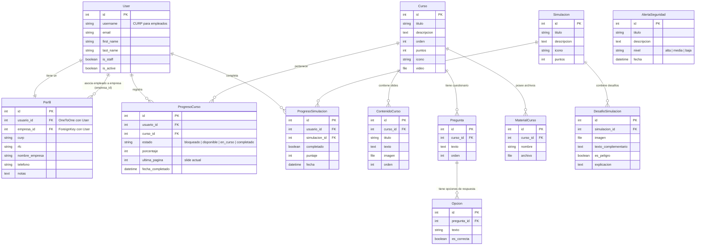

# Diagrama de la Base de Datos (Modelo Entidad-Relación)

Este diagrama representa la estructura de las tablas de la base de datos de la plataforma y sus relaciones.

---

## Descripción de las Relaciones Clave

1. **Usuarios y Perfiles (Multi-tenancy)**: 
   - La tabla `User` (nativo de Django) se extiende mediante `Perfil` (relación 1-a-1).
   - Un empleado tiene su perfil asociado a una empresa (`empresa_id` apunta al `User` de tipo Empresa), permitiendo la segmentación de datos.

2. **Cursos y Contenido**:
   - Cada `Curso` tiene un conjunto ordenado de diapositivas (`ContenidoCurso`), archivos multimedia (`MaterialCurso`) y un cuestionario final (`Pregunta` -> `Opcion`).

3. **Seguimiento de Progreso**:
   - `ProgresoCurso` y `ProgresoSimulacion` actúan como tablas relacionales que enlazan a los usuarios con su avance individual, guardando el estado, página actual y puntuaciones.
